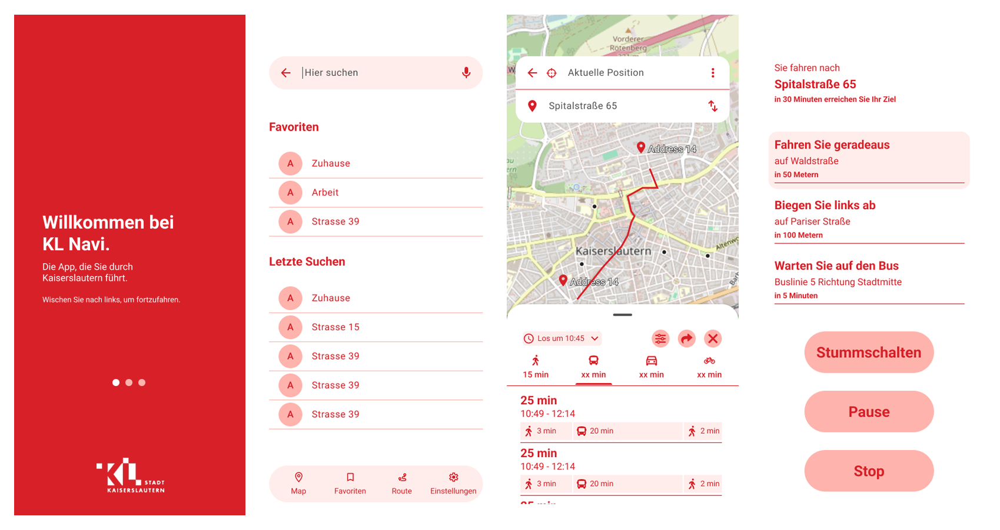

# Navi4All • Multi-modal navigation for everyone

***This project is currently in the early stages of development.***

Navi4All is an open-source, multi-modal navigation app designed to provide accessible navigation solutions for everyone, including those with disabilities.

*Note: Screenshots are illustrative and may not represent the final version of the app.*

## Features
- **Accessibility-first Design**: Conceptualised and built with accessibility in mind, ensuring that users with diverse needs can navigate easily.
- **Multi-modal Navigation**: Supports various transportation modes including walking, cycling, driving, and public transit.
- **POI Integration**: Allows users to find and navigate to Points of Interest (POIs).

## User Profiles
- **General Users**: The standard app interface with a visual-first navigation experience.
- **Visually Impaired Users**: Features tailored for users with visual impairments, including a high-contrast interface and large interactive elements.
- **Blind Users**: Enhanced functionality for users experiencing total vision impairment, such as semantic audio cues, haptic feedback, and an audio-first navigation experience.
- **Mobility Impaired Users**: Customised navigation options for users with mobility challenges, including wheelchair-friendly routes.

## Codebase

A monolithic codebase that includes:
- **Cross-platform mobile app**: Built using Flutter, ensuring compatibility with both Android and iOS devices, along with web support.
- **Backend services**: Implemented in Python, providing the necessary APIs and data processing capabilities.
- **OpenTripPlanner**: Integrated for advanced routing and trip planning functionalities.
